# README.md

## Build and Run Commands

```bash
# Start PostgreSQL database (requires Docker)
cd .. && docker-compose up -d

# Build the project
dotnet build

# Run the application
dotnet run

# Build for release
dotnet build -c Release
```

## Technology Stack

- .NET 9.0 Windows Forms application
- Entity Framework Core 9.0.3 with PostgreSQL database
- PostgreSQL 16 in Docker (docker-compose.yml in parent directory)
- Database connection: `Host=localhost;Port=5432;Database=equipment_db;Username=equipment_user;Password=equipment_pass`

## Architecture Overview

This is a TV channel content management application for managing rights owners, films, contacts, and TV schedules. The UI is in Russian.

### Data Layer
- `Data/AppDbContext.cs` - EF Core DbContext with DbSets for all entities
- Database is auto-created on first run with seed data in `Program.cs`
- Uses lazy loading proxies for navigation properties

### Models
- `User` - Authentication with Login, Password, RoleId (foreign key to Role)
- `Role` - Permissions system with granular access controls
- `RightsOwner` - Rights holder (e.g., Беларусьфильм, Paramount)
- `Film` - Film entity with title, age restriction, duration, file path, purchase date, rights expiration, show count
- `Contact` - Contact information for rights sellers
- `TvScheduleEntry` - TV program schedule entries

### Roles and Permissions
- **Администратор** - Full system access
- **Инженер видеомонтажа** - Creates rights owners, adds films with basic info (title, age, duration, file path)
- **Специалист** - Edits rights info (purchase date, expiration, show count), manages contacts
- **Руководитель** - View-only access

### Forms Architecture
- `LoginForm` - Entry point with logo, authenticates against Users table
- `MainForm` - MDI container with role-based menu navigation and header with logo
- `Forms/CRUD/CrudForm<T>` - Generic abstract base class providing standardized CRUD UI

### Menu Structure
- **Контент** - Rights owners list, opens films for each owner
- **Контакты** - Contact management
- **Программа** - TV schedule with show count tracking
- **Администрирование** - User and role management (admin only)
- **Справка** - About dialog

### Key Features
- Role-based access control (RBAC) with granular permissions
- TV schedule with automatic show count decrement when films are aired
- Films cannot be added to schedule if show count is 0 or rights have expired
- Color-coded display for expired rights and low show counts
- Replaceable TV channel logo (`logo.png` in output directory)

### Utils
- `InputDialog` - Reusable prompt dialog for user input
- `SessionManager` - Static class for managing current user session and permission checks

## Default Credentials
- Admin: login=`admin`, password=`admin`
- Video Editor: login=`editor`, password=`editor`
- Specialist: login=`specialist`, password=`specialist`
- Manager: login=`manager`, password=`manager`

## Logo
Place a `logo.png` file in the application directory (or bin/Debug/net9.0-windows/) to display the TV channel logo on the login and main forms.


# Диаграммы системы учёта контента телеканала

## 1. ER-диаграмма базы данных (Entity-Relationship Diagram)

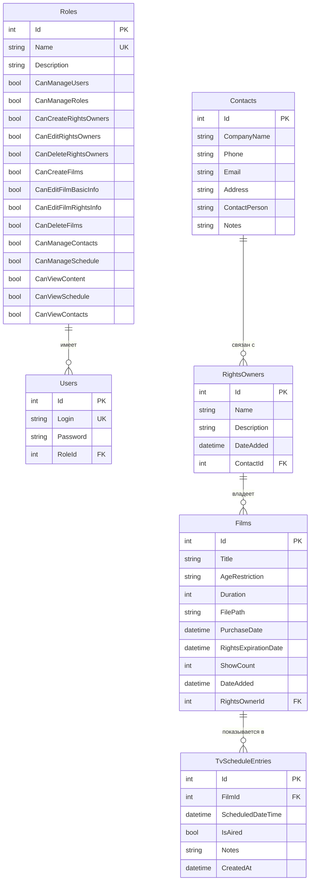

## 2. Диаграмма архитектуры приложения (Component Diagram)

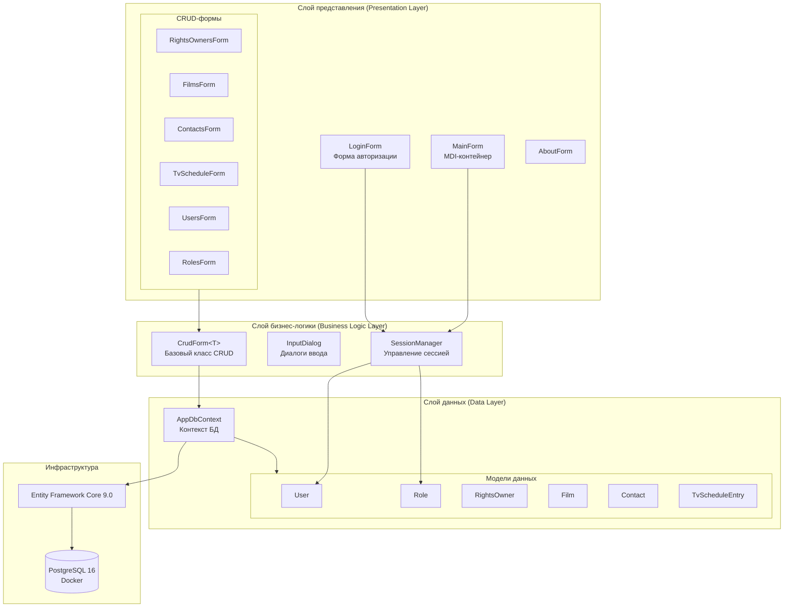

## 3. Диаграмма классов моделей (Class Diagram)

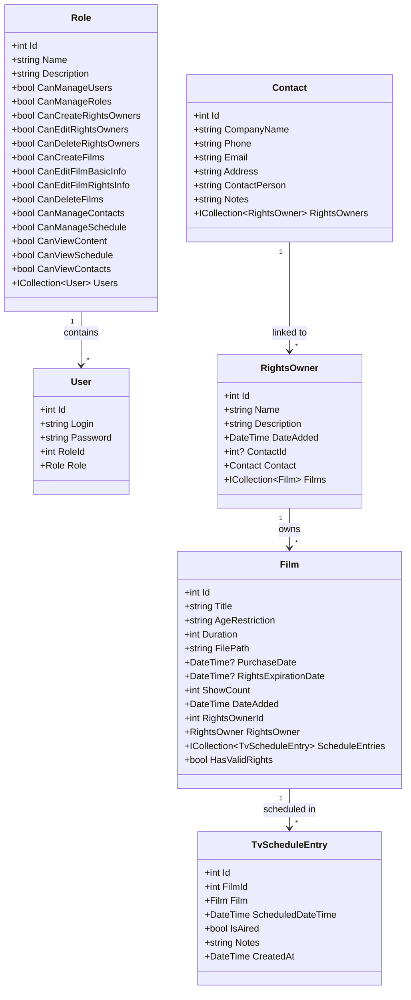

## 4. Диаграмма вариантов использования (Use Case Diagram)

```mermaid
flowchart TB
    subgraph Actors["                                          Актёры                                          "]
        direction LR
        Admin(("Администратор"))
        VideoEditor(("Инженер<br/>видеомонтажа"))
        Specialist(("Специалист"))
        Manager(("Руководитель"))
    end

    subgraph UseCases["                                                                    Варианты использования                                                                    "]
        direction LR

        subgraph Auth["Авторизация"]
            UC1["Вход в систему"]
        end

        subgraph Content["Управление контентом"]
            direction TB
            UC2["Просмотр<br/>правообладателей"]
            UC3["Создание<br/>правообладателя"]
            UC4["Редактирование<br/>правообладателя"]
            UC5["Удаление<br/>правообладателя"]
            UC6["Просмотр<br/>фильмов"]
            UC7["Создание<br/>фильма"]
            UC8["Редактирование<br/>базовой инфо"]
            UC9["Редактирование<br/>прав на показ"]
            UC10["Удаление<br/>фильма"]
        end

        subgraph Contacts["Контакты"]
            direction TB
            UC11["Просмотр<br/>контактов"]
            UC12["Управление<br/>контактами"]
        end

        subgraph Schedule["Телепрограмма"]
            direction TB
            UC13["Просмотр<br/>программы"]
            UC14["Управление<br/>программой"]
        end

        subgraph AdminPanel["Администрирование"]
            direction TB
            UC15["Управление<br/>пользователями"]
            UC16["Управление<br/>ролями"]
        end
    end

    %% Администратор - полный доступ
    Admin --> UC1
    Admin --> UC2 & UC3 & UC4 & UC5
    Admin --> UC6 & UC7 & UC8 & UC9 & UC10
    Admin --> UC11 & UC12
    Admin --> UC13 & UC14
    Admin --> UC15 & UC16

    %% Инженер видеомонтажа
    VideoEditor --> UC1
    VideoEditor --> UC2 & UC3 & UC4
    VideoEditor --> UC6 & UC7 & UC8
    VideoEditor --> UC13

    %% Специалист
    Specialist --> UC1
    Specialist --> UC2 & UC6 & UC9
    Specialist --> UC11 & UC12
    Specialist --> UC13

    %% Руководитель - только просмотр
    Manager --> UC1
    Manager --> UC2 & UC6
    Manager --> UC11
    Manager --> UC13
```

## 5. Диаграмма последовательности: Авторизация пользователя

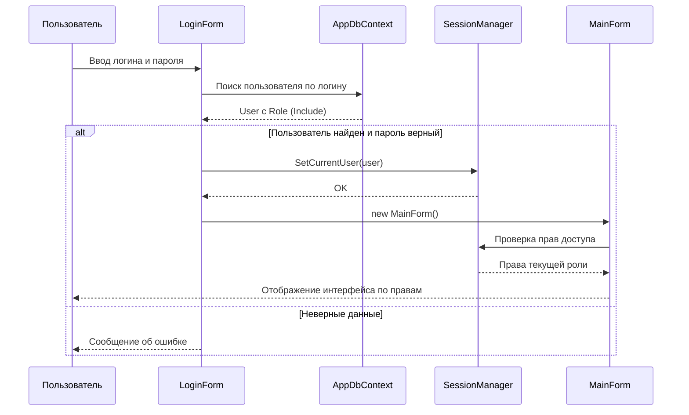

## 6. Диаграмма последовательности: Добавление фильма в телепрограмму

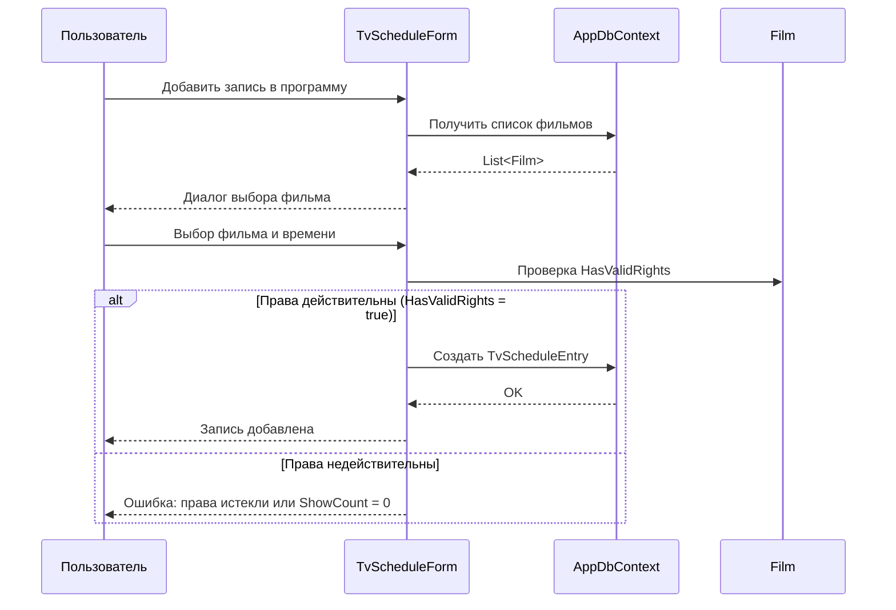

## 7. Диаграмма последовательности: Обработка эфира

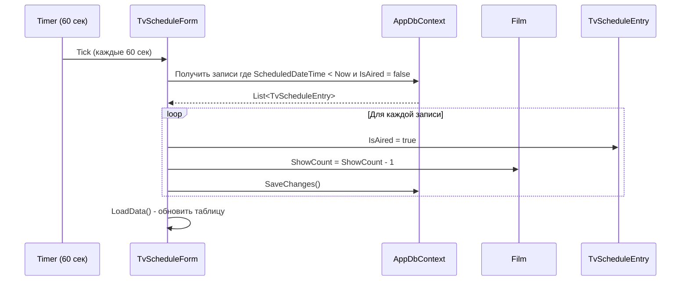

## 8. Диаграмма состояний фильма

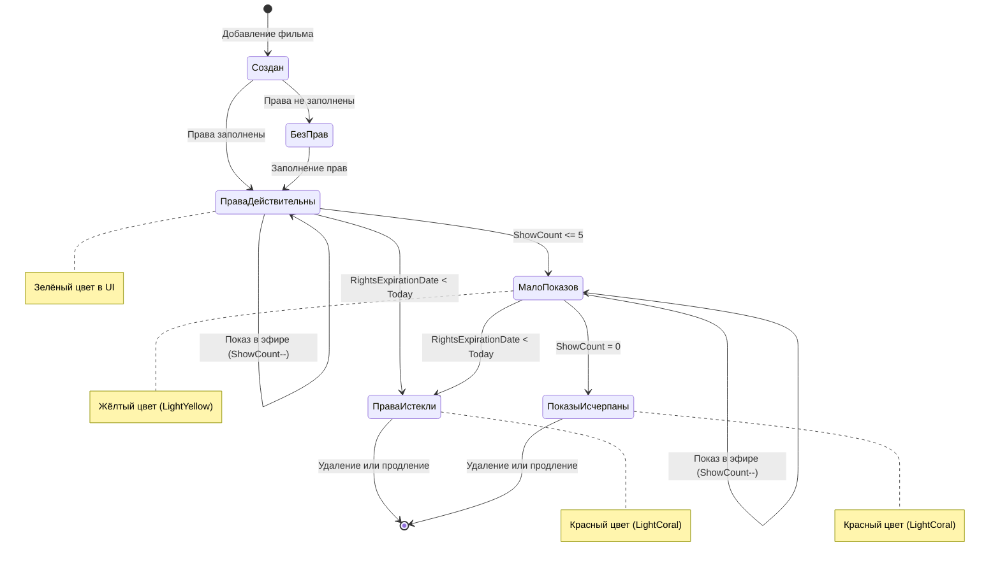

## 9. Диаграмма развёртывания (Deployment Diagram)

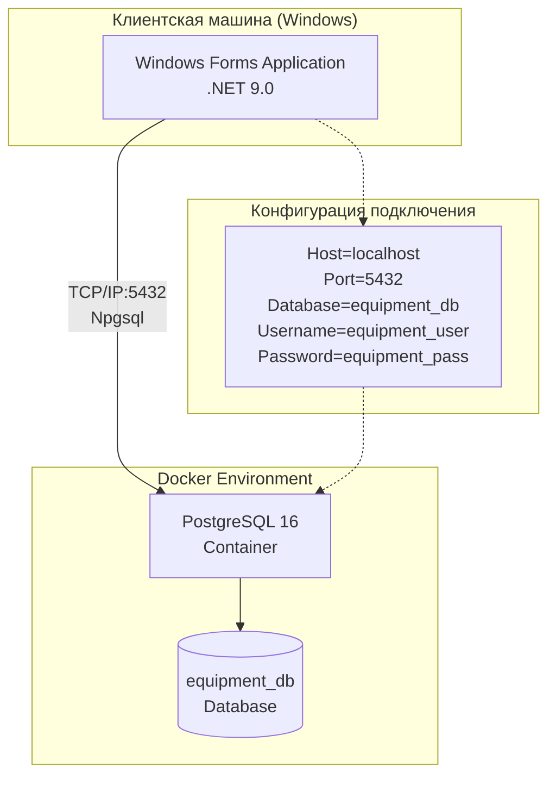

## 10. Диаграмма потоков данных (Data Flow Diagram)

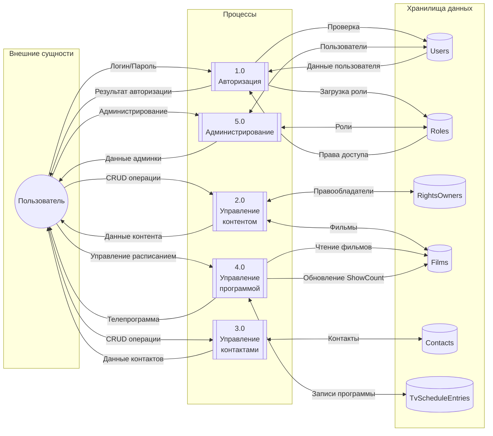

## 11. Матрица прав доступа по ролям

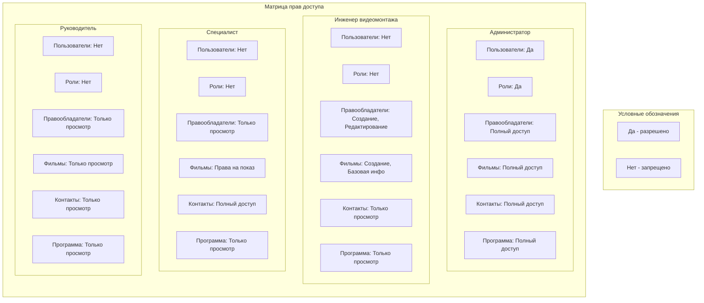
